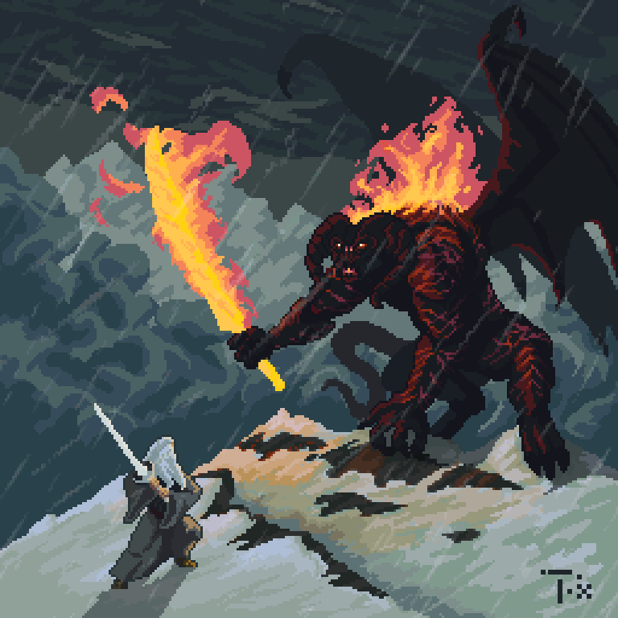
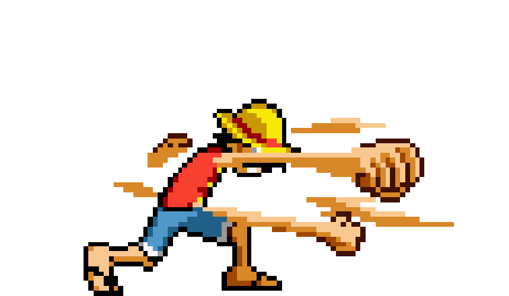

  

 

  

    
  

  

  

  

      

    Hey, welcome! Make yourself confortable :)
     
    My name is Alaquoke. I'm a software developer and I'm currently working
    with Laravel and Vue.js.
     
    I'm obsessed with One Piece, Lord of the Rings and Harry Potter. I love cup noodles,
    Lana del Rey and RPDR.
     
    There really isn't much to see here, my github is dying because I only
    use GitLab for work. Really glad you came tho! :smiling_face_with_three_hearts::smiling_face_with_three_hearts::smiling_face_with_three_hearts:
  

  

  

    
    

      Made with metrics provided by
      <a href="https://github.com/lowlighter/metrics">
        Lowlighter
      </a>
    

    

  

  

    
  

  

  
  
          

